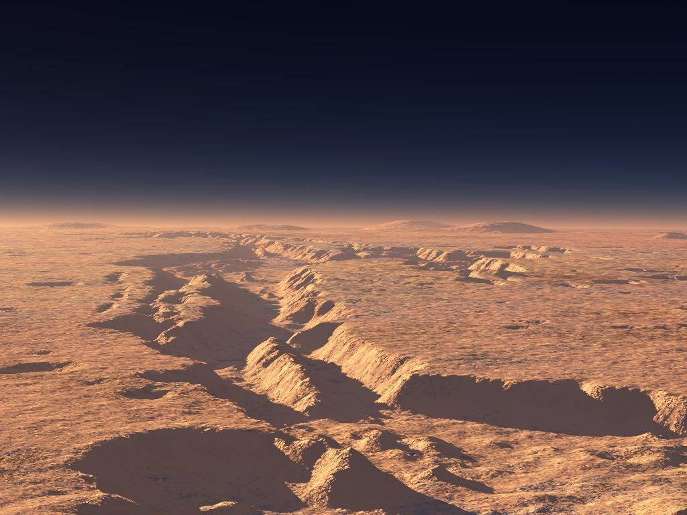

# About

Located in the solar system's largest canyon, Valles Marineris on Mars, the Mars Underground Restaurant is one of the most known and renowned restaurants in our galaxy.  

Experience one of our most beautiful dining halls where you can catch blue sunsets in the twilight, and see the two moons of Mars (Phobos and Deimos) in the night sky.
